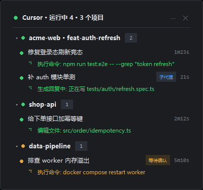

# cursor-float

一个常驻置顶的小浮窗，实时显示 **Cursor 里正在运行的 Agent 会话**——按项目分组、可折叠，每个会话显示名称、状态、以及**此刻正在执行什么**（跑哪条命令、改哪个文件），类似 Codex 的浮窗。



<sub>上图是 `--demo` 假数据渲染的实际窗口截图。琥珀色圆点表示该项目里有会话在「等待确认」，蓝灰色「子代理」标签表示这是子代理会话。</sub>

结构是这样：**项目**是一级分组（可折叠），**会话名称**在组内逐条列出，执行细节在名称下面。

```
▾ acme-web · feat-auth-refresh                          [2]
  ● 修复登录态刷新竞态                                      1m23s
    ⠋ 执行命令: npm run test:e2e -- --grep "token refresh"
  ● 补 auth 模块单测                            子代理          21s
    ⠙ 生成回复中: 正在写 tests/auth/refresh.spec.ts
▾ shop-api                                              [1]
  ● 给下单接口加幂等键                                     2m12s
    ⠙ 编辑文件: src/order/idempotency.ts
▸ data-pipeline                                         [1]  执行命令
```

折叠起来的分组仍会显示会话数量，以及该项目里最紧急的状态色和当前动作类型。折叠状态会记住。

## 启动

双击 `启动悬浮窗.bat`，或者：

```powershell
.\start.ps1              # 正常启动
.\start.ps1 --demo       # 假数据启动，只想看看长什么样
```

窗口操作：

| 操作 | 效果 |
|---|---|
| 按住拖动 | 移动窗口（位置会记住） |
| 点击项目行 | 折叠 / 展开该项目 |
| `⋯` | 立即刷新 / 展开全部 / 折叠全部 / 切换置顶 / 退出 |
| `✕` | 退出 |

## 它是怎么知道 Cursor 在干什么的

**完全不碰 Cursor 的任何文件写入，也不装扩展、不调 API**，只以只读方式打开 Cursor 自己的本地状态库：

```
%APPDATA%\Cursor\User\globalStorage\state.vscdb      (SQLite，本机约 8 GB)
```

用到里面三处数据：

| 数据 | 用途 |
|---|---|
| `composerHeaders` 表 | 会话清单：标题、所属工作区、最后活动时间、是否归档、是否子代理 |
| `cursorDiskKV['composerData:<id>']` | 实时状态：`status`、`generatingBubbleIds`、`todos`、worktree 标志 |
| `cursorDiskKV['bubbleId:<id>:<bid>']` | 最近一次工具调用：工具名 + 命令/文件路径 + 执行状态 |

### 「正在运行」是怎么判定的（这节很重要）

Cursor 主程序里确实有一套状态机——新会话 `status = "none"`，请求开始时置 `"generating"`，
结束为 `"completed"`，中断为 `"aborted"`。**但那是内存里的对象，落盘到 `state.vscdb` 的
时机完全不同步。**

在真实库上连续采样一个正在生成中的会话，得到的是：

| 字段 | 生成期间的实际表现 |
|---|---|
| `composerData.status` | 恒为 `"aborted"` —— 上一次落盘的残留值，**不是实时状态** |
| `composerData.generatingBubbleIds` | 恒为 `[]` —— **不是实时状态** |
| `composerHeaders.lastUpdatedAt` | 冻在回合开始那一刻，全程不动 |
| `composerHeaders.checkpointAt` | 也不是心跳，会停在某一刻 |
| **`composerData` 的内容** | **在变**：气泡数 42→43→44→45，blob 长度 +447 / +8456 / -8079 |
| **最后一条气泡的 `toolFormerData`** | **在换**：`run_terminal_command_v2` → None → `glob_file_search` |
| **该工具的 `status`** | **`"loading"`** |

所以判定依据是：

1. **内容在变化**（主信号）：记录每个会话 `composerData` 的指纹（气泡数 + 最后一条气泡 id），
   两次轮询之间变了就说明它在干活；最后一次变化后 45 秒内仍视为运行中，用来跨过工具调用
   之间的空档。
2. **最后一条工具的状态是 `loading`**（辅助信号）：Cursor 对正在执行的工具写的就是这个值。
   实测 40 个已结束的会话里，最后一条气泡要么没有工具、要么是 `completed`，只有真正在跑的
   那个是 `loading`，所以这个信号可以放心用。
3. 另外还会认 `generatingBubbleIds`、`isApplyingWorktree` 等字段，以及
   `hasBlockingPendingActions`（标成琥珀色的「等待确认」）。

> **别改回去用 `status` 判断。** 那是最初版本的写法，表现就是「明明在跑却什么都不显示」。

「当前执行什么」按优先级取：正在跑的工具 → 内容正在变化（正在生成回复，附带进行中的 todo）→
Cursor 自己的 `subtitle` 摘要。工具名会翻译成中文，例如 `run_terminal_command_v2` → `执行命令`。

### 不显示？先跑这个

```powershell
python cursor_float.py --watch --signals
```

它会逐个列出**本次检查过哪些会话、各自的判断依据、以及为什么没显示**，例如：

```
· 1a2b3c4d [不显示] my-project / 重构支付回调
    status=completed 气泡=54 gen=0 内容变化=False 45秒内变化过=False 工具在跑=False 头部新鲜=False (头部329.2秒前)
    => 没有任何活跃证据（内容没变、工具没在跑）
```

看到 `内容变化=False` 且 `工具在跑=False`，就说明那个会话确实没有在动。

## 性能

状态库接近 8 GB，单个会话对象最大见过 3.9 MB（json 解析约 25 ms，是这里最大的开销）。
做法：

1. **带摘要校验的解析缓存**：先取原始字节算出「长度 + 内容摘要」，和上次一致就直接复用
   解析结果，跳过 `json.loads`。不要退化成只比长度——内容更新后长度有可能恰好不变。
2. **只检查值得看的会话**：头部时间戳在 15 分钟窗口内的、最近被判定活跃过的、最靠前的
   若干条；启动首轮再多看几个（不超过 `first_scan`）。

本机实测：稳态每次轮询中位数 **17 ms**，启动首轮 **78 ms**（最早版本稳态 78 ms、
首轮 494 ms），默认 900 ms 一轮。

## 配置

在脚本同目录建 `config.json`，覆盖任意一项即可：

```json
{
  "interval_ms": 900,
  "grace_seconds": 25,
  "activity_grace_sec": 45,
  "candidate_window_sec": 900,
  "track_keep_sec": 600,
  "header_scan": 60,
  "live_scan": 8,
  "first_scan": 12,
  "max_rows": 8,
  "width": 400,
  "alpha": 0.96,
  "topmost": true
}
```

| 项 | 含义 |
|---|---|
| `interval_ms` | 轮询间隔 |
| `grace_seconds` | 头部时间戳在此秒数内仍视为运行中，用于回合刚开始的时刻 |
| `activity_grace_sec` | 观察到内容变化后，还视为「运行中」多久（跨过工具调用之间的空档） |
| `candidate_window_sec` | 头部时间戳在此窗口内的会话会去检查 |
| `track_keep_sec` | 曾经活跃过的会话，继续检查多久 |
| `live_scan` | 无论时间戳如何都强制检查的最靠前会话数（兜底） |
| `first_scan` | 启动首轮最多检查多少个（避免首屏把历史大对象全解析一遍） |
| `max_rows` | 窗口内最多显示几条会话（不作用于折叠的项目行） |

## 命令行

```powershell
python cursor_float.py --once              # 打印一次快照（默认观察最多 4 秒）
python cursor_float.py --watch --signals   # 终端滚动输出，并显示判定依据明细
python cursor_float.py --json              # JSON 输出，便于接别的工具
python cursor_float.py --demo              # 假数据渲染窗口
```

**`--once` 默认会观察最多 4 秒**，因为判定依赖「内容较上一轮有变化」，只查一轮会把
正在跑的会话漏掉（这一点踩过坑：同一个库，浮窗显示有会话在跑，`--once` 却报空）。
`--settle 0` 只看一轮，`--settle 10` 多等一会儿。

`--watch --signals` 会逐个列出每个会话的判定依据，排查「为什么没显示」时最有用。

## 测试

```powershell
python -m unittest test_cursor_float -v
```

23 个用例，用临时构造的 SQLite 库模拟各种会话状态，不依赖本机真实数据。覆盖：

- 生成中 / 工具执行中 / 等待确认 / 已归档 / 结束即消失
- **真实落盘行为**：`status="aborted"`、`generatingBubbleIds` 为空、头部时间戳冻住，
  只靠内容变化识别出活跃会话
- **`toolFormerData.status == "loading"` 算在跑，`"completed"` 不算**
- 内容停止变化后超过宽限期即消失
- 解析缓存在 blob 未变化时不重复 `json.loads`
- **两个项目的任务同时在跑，两个都要显示**
- **长时间运行的任务**：头部时间戳过期 + 状态对象很大，仍然不能丢
- worktree 路径显示成 `repo · worktree 名`

## 已知限制

- 只覆盖**本机 Cursor**。云端/后台 Agent 走的是另一套 `BackgroundComposerStatus`，本工具不处理。
- 依赖 Cursor 的内部存储结构。Cursor 升级若改了 `state.vscdb` 的字段，需要跟着调整；
  核对方法见上面「它是怎么知道」一节。
- 浮窗是独立进程，不随 Cursor 启停；关掉 Cursor 后它会显示「空闲」。

## 文件

| 文件 | 说明 |
|---|---|
| `cursor_float.py` | 主程序（数据层 + tkinter 悬浮窗 + CLI） |
| `start.ps1` | 启动脚本，自动寻找带 tkinter 的 Python |
| `启动悬浮窗.bat` | 双击启动 |
| `test_cursor_float.py` | 判定逻辑测试 |
| `window.json` | 运行时生成，记住窗口位置和折叠状态 |
| `config.json` | 可选，覆盖默认配置 |
